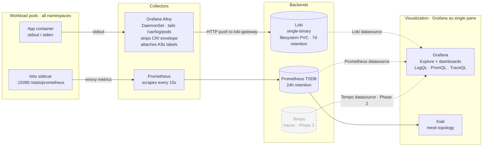

# gitops

GitOps config repo for AuraAITools. ArgoCD reconciles every cluster from this repo. See [`GITOPS_STRATEGY.md`](./GITOPS_STRATEGY.md) for the architecture rationale.

## Dashboards

| Dashboard   | Public URL                                            | Port-forward fallback                                                                | What it shows                                                                  |
| :---------- | :---------------------------------------------------- | :----------------------------------------------------------------------------------- | :----------------------------------------------------------------------------- |
| **ArgoCD**  | https://argocd.auraenterprise.solutions †             | `kubectl -n argocd port-forward svc/argocd-server 8080:80` → http://localhost:8080   | Applications, sync status, sync history, drift, manual sync. Root-credential target — gate behind Cloudflare Access SSO. |
| **Grafana** | https://grafana.auraenterprise.solutions †            | `kubectl -n monitoring port-forward svc/kube-prometheus-stack-grafana 3000:80` → http://localhost:3000 | Cluster + node metrics out of the box plus pod logs (via the Loki datasource — open **Explore**, pick **Loki**, query e.g. `{namespace="apps-dev"}`). Istio's canonical dashboards (Mesh / Service / Workload / Performance / Control Plane / Extension) appear under the **Istio** folder — pulled from `istio/istio@release-1.30` at helm-template time. |
| **Kiali**   | (port-forward only — VS commented out) ‡              | `kubectl -n kiali port-forward svc/kiali 20001:20001` → http://localhost:20001       | Service mesh topology, traffic graph, per-service request rate / error rate.   |
| **Vault**   | (port-forward only — never expose)                    | `kubectl -n vault port-forward svc/vault 8200:8200` → http://localhost:8200          | KV secret store; **never** expose publicly — root token unlocks every app secret. See **Managing secrets**. |

† VirtualService committed in this repo (`core/<svc>/routing/virtualservice.yaml`). The hostname only resolves publicly **after** you add the matching Cloudflare Tunnel ingress rule (Cloudflare dashboard → Zero Trust → Tunnels → public hostnames) AND attach a Cloudflare Access SSO policy. Without those, traffic still flows in-cluster but the hostname returns the tunnel's default 404 from the public internet.

‡ Kiali's VirtualService is scaffolded at `core/kiali/routing/virtualservice.yaml` but **commented out** until a Cloudflare Access SSO policy is in place. Kiali is configured with `auth.strategy: anonymous`, so any public exposure without Access would leak full cluster topology, image tags, and Istio config. Uncomment + push only after the Cloudflare-side Access app exists.

**Initial credentials** (rotate after first login):
- ArgoCD: `admin` / `kubectl -n argocd get secret argocd-initial-admin-secret -o jsonpath='{.data.password}' | base64 -d`
- Grafana: `admin` / `admin` (set in `core/monitoring/values.yaml`)
- Kiali: anonymous (homelab only — change `auth.strategy` before any shared env)
- Vault: **root token** from first-time `vault operator init` — see **Managing secrets** below for the one-time unseal/init runbook

## Application endpoints

Public hostnames follow `<svc>[-<env>].auraenterprise.solutions`. Traffic flow:

```
Browser → Cloudflare edge (TLS termination) → Cloudflare Tunnel → cloudflared (in-cluster)
       → http://istio-ingressgateway.istio-ingress.svc:80 → VirtualService (host-matched)
       → app Service → app pods
```

The Istio gateway listens on `*.auraenterprise.solutions` (shared `public-gateway` in `istio-ingress`); each app's `VirtualService` matches its concrete host. Cloudflare-side ingress rules (managed in the Cloudflare dashboard for the tunnel) decide which hostnames are publicly routable — listing a host in a VirtualService does NOT make it public until a Cloudflare ingress rule also points at the tunnel.

### Per-environment hosts

| Service              | Dev                                         | Staging                                          | Prod                                    | Status |
| :------------------- | :------------------------------------------ | :----------------------------------------------- | :-------------------------------------- | :----- |
| **BFF** (aura-report-website) | `app-dev.auraenterprise.solutions` ✅ | `app-staging.auraenterprise.solutions` ❌  | `app.auraenterprise.solutions` ✅       | dev + prod deployed; needs `ecr-pull` + `bff-secrets`; staging not deployed |
| **report-ms** (Java backend)  | `api-dev.auraenterprise.solutions` ✅ | `api-staging.auraenterprise.solutions` ❌  | `api.auraenterprise.solutions` ✅       | dev + prod deployed; needs `ecr-pull` + `report-ms-secrets`; staging not deployed |
| **Keycloak** (public OIDC)    | `accounts-dev.auraenterprise.solutions` ✅ | `accounts-staging.auraenterprise.solutions` ❌ | `accounts.auraenterprise.solutions` ✅ | dev + prod deployed; staging not deployed |
| **Keycloak** (admin console)  | `admin-accounts-dev.auraenterprise.solutions` ✅ | `admin-accounts-staging.auraenterprise.solutions` ❌ | `admin-accounts.auraenterprise.solutions` ✅ | dev + prod deployed; staging not deployed |
| **SpiceDB** (gRPC, internal)  | n/a                                         | n/a                                              | n/a                                     | operator-pending — will be re-introduced via [`spicedb-operator`](https://authzed.com/docs/spicedb/ops/operator) |

### Cloudflare Tunnel (public ingress)

In-cluster `cloudflared` Deployment dials outbound to Cloudflare's edge; no inbound ports needed on the Mac mini. See [Cloudflare Tunnel bootstrap](#cloudflare-tunnel-bootstrap) below for the one-time setup (create a tunnel, drop the token as a Secret, configure public-hostname → service rules in the Cloudflare dashboard).

### Internal access (port-forward)

ArgoCD, Vault, Grafana, Kiali — no public VirtualService. Reach them by `kubectl port-forward` (commands in the Dashboards table at the top of this README).

### In-cluster DNS (always works once the Service exists)

App-to-app calls inside the mesh use cluster DNS — short form within the same namespace, FQDN across.

| Service              | In-cluster URL (same-ns short form)               | Cross-ns FQDN                                     |
| :------------------- | :------------------------------------------------ | :------------------------------------------------ |
| BFF                  | `http://aura-report-website:3000`                 | `http://aura-report-website.apps-<env>.svc:3000`  |
| report-ms (HTTP/GraphQL) | `http://report-ms:8080`                       | `http://report-ms.apps-<env>.svc:8080`            |
| Keycloak             | `http://keycloak:8080`                            | `http://keycloak.apps-<env>.svc:8080`             |
| SpiceDB (gRPC)       | `dev-spicedb:50051` (operator-pending)            | `dev-spicedb.apps-<env>.svc:50051` (operator-pending) |
| postgres-aura (rw)   | `postgres-aura-rw:5432`                           | `postgres-aura-rw.apps-<env>.svc:5432`            |
| postgres-keycloak (rw) | `postgres-keycloak-rw:5432`                     | `postgres-keycloak-rw.apps-<env>.svc:5432`        |

### Port-forward (poking from your laptop until routing is up)

```bash
# Keycloak — dev (substitute apps-prod for prod)
kubectl -n apps-dev port-forward svc/keycloak 8081:8080
# http://localhost:8081  — admin / admin (rotate immediately)

# report-ms — once deployed
kubectl -n apps-dev port-forward svc/report-ms 8082:8080
# GraphQL at http://localhost:8082/graphql, actuator at /actuator/health

# BFF — once deployed
kubectl -n apps-dev port-forward svc/aura-report-website 3000:3000
# http://localhost:3000

# Postgres (psql via the cnpg plugin or raw)
kubectl -n apps-dev port-forward svc/postgres-aura-rw 5432:5432
# psql "postgresql://aura:$(kubectl -n apps-dev get secret postgres-aura-app -o jsonpath='{.data.password}' | base64 -d)@localhost:5432/aura"
```

### Initial credentials

| Service                     | User    | Password source                                                                                                       |
| :-------------------------- | :------ | :-------------------------------------------------------------------------------------------------------------------- |
| Keycloak admin console (all envs) | `admin` | base-encoded `admin` in `apps/keycloak/base/admin-secret.yaml` — **rotate via the Keycloak admin console after first login** |
| Postgres app users (all DBs / envs) | `<dbname>` (e.g. `aura`, `keycloak`) | CNPG-generated `postgres-<db>-app` Secret in `apps-<env>`. Key: `password`. |

## Layout

```
bootstrap/
├── root-app.yaml                    # the only thing applied by hand — App-of-Apps root
└── apps/                            # every other Application lives here
    ├── argocd.yaml                  # ArgoCD self-management        (sync-wave -10)
    ├── istio-base.yaml              # CRDs                          (sync-wave 0)
    ├── istiod.yaml                  # control plane                 (sync-wave 1)
    ├── istio-gateway.yaml           # ingress gateway               (sync-wave 2)
    ├── routing.yaml                 # shared *.auraenterprise.solutions Gateway (sync-wave 3)
    ├── argocd-routing.yaml          # argocd VirtualService         (sync-wave 3)
    ├── cloudflared.yaml             # Cloudflare Tunnel daemon      (sync-wave 3)
    ├── kube-prometheus-stack.yaml   # Prom + Grafana + Alertmgr     (sync-wave 4)
    ├── kiali.yaml                   # mesh topology dashboard       (sync-wave 5)
    ├── vault.yaml                   # HashiCorp Vault (KV store)    (sync-wave 5)
    ├── vault-routing.yaml           # vault VirtualService (port-forward only by default) (sync-wave 5)
    ├── vault-secrets-operator.yaml  # VSO — syncs Vault → K8s Secrets (sync-wave 5)
    ├── vault-config.yaml            # VaultConnection + auth-delegator SA (sync-wave 6)
    ├── apps-project.yaml            # AppProject + apps-{dev,staging,prod} ns (wave 6)
    ├── cloudnative-pg.yaml          # CNPG operator                 (sync-wave 6)
    ├── ecr-rotator.yaml             # ECR pull-cred CronJob         (sync-wave 6)
    ├── postgres-<db>-<env>.yaml     # 2 databases × 3 envs = 6 Apps (sync-wave 7)
    │                                # db ∈ {aura, keycloak}
    │                                # env ∈ {dev, staging, prod}
    ├── keycloak-{dev,prod}.yaml     # IdP                           (sync-wave 8)
    ├── report-ms-{dev,prod}.yaml    # Java backend                  (sync-wave 9)
    └── aura-report-website-{dev,prod}.yaml  # Next.js BFF           (sync-wave 10)
core/                                # values / overlays for platform components
├── argocd/
│   ├── values.yaml
│   └── routing/                     # VirtualService for argocd (no public Cloudflare hostname — gate behind Access SSO before exposing)
├── routing/
│   └── public-gateway.yaml          # shared Gateway in istio-ingress; hosts: ["*.auraenterprise.solutions"]
├── cloudflared/                     # Cloudflare Tunnel daemon (Deployment + namespace)
├── istio/{istiod,gateway}-values.yaml
├── monitoring/values.yaml           # kube-prometheus-stack
├── kiali/values.yaml
├── vault/                           # Helm values + VirtualService for vault (port-forward only by default — do not expose publicly)
├── vault-secrets-operator/          # VSO Helm values
├── vault-config/                    # VaultConnection + auth-delegator SA (cross-namespace)
├── apps-project/                    # AppProject `apps` + 3 env namespaces
├── cloudnative-pg/values.yaml
└── ecr-rotator/                     # CronJob + RBAC; refreshes ecr-pull Secret in apps-* every 8h
apps/                                # application workloads (DRY tree, hydrated by Source Hydrator)
├── postgres-aura/                   # main application DB
│   ├── base/                        # CNPG Cluster CR — name: postgres-aura, db: aura
│   └── overlays/{dev,staging,prod}/ # per-env storage / replica patches
├── postgres-keycloak/               # identity provider DB
│   ├── base/                        # name: postgres-keycloak, db: keycloak
│   └── overlays/{dev,staging,prod}/
├── keycloak/                        # IdP
│   ├── base/                        # Deployment + Service + admin Secret + realm.json
│   └── overlays/{dev,prod}/         # per-env KC_HOSTNAME + VirtualService
├── report-ms/                       # Java backend (Spring Boot)
│   ├── base/                        # Deployment + Service + ConfigMap (constants)
│   └── overlays/{dev,prod}/         # per-env S3 bucket + VirtualService
└── aura-report-website/             # Next.js BFF
    ├── base/                        # Deployment + Service + ConfigMap
    └── overlays/{dev,prod}/         # per-env NEXTAUTH_URL + KEYCLOAK_ISSUER + VirtualService
```

## Pinned versions

| Component               | Version  | Notes                                              |
| :---------------------- | :------- | :------------------------------------------------- |
| ArgoCD Helm chart       | `9.5.17` | ships ArgoCD `v3.4.3`; Source Hydrator (alpha) on  |
| Istio                   | `1.30.0` | sidecar mode                                       |
| kube-prometheus-stack   | `86.1.0` | Prometheus Operator `v0.91.0`                      |
| Kiali                   | `2.27.0` | Helm chart `kiali/kiali-server`                    |
| CloudNativePG operator  | `0.28.2` | operator `v1.29.1` — manages all 3 env Postgres    |
| HashiCorp Vault         | `1.18.0` | chart `0.31.0`; single-node Raft + Shamir seal     |
| Vault Secrets Operator  | `0.10.0` | chart `0.10.0`; syncs `VaultStaticSecret` CRDs → K8s Secrets |

Bump deliberately, never track `latest`.

## Concepts

### Sync waves

ArgoCD reconciles in **waves**, not all-at-once. The annotation `argocd.argoproj.io/sync-wave: "<int>"` assigns a resource (or, in an App-of-Apps, a child Application) to a wave. ArgoCD then:

1. Sorts everything in the sync by wave number, ascending (negatives first).
2. Applies every resource in the lowest wave in parallel.
3. **Waits for that wave to report `Healthy`** before starting the next one.
4. Default wave is `0` if the annotation is missing.

This is how you express "X must exist and be ready before Y is created." It's the GitOps replacement for `helm install --wait && kubectl wait && helm install` chains.

Waves in this repo:

| Wave | App              | Why it has to go in this order                                                                  |
| :--- | :--------------- | :---------------------------------------------------------------------------------------------- |
| `-10`| `argocd`         | Self-management has to take over the in-place Helm release before any other App starts syncing. |
| `0`  | `istio-base`     | Installs the Istio CRDs. Everything below references them — without these, manifests fail.      |
| `1`  | `istiod`         | The control plane; admission webhook for sidecar injection. Gateways can't come up without it.  |
| `2`  | `istio-gateway`  | Gateway pods need sidecars injected by `istiod`, so this can't race ahead.                      |
| `3`  | `routing`, `argocd-routing`, `cloudflared` | Shared `public-gateway` (hosts `*.auraenterprise.solutions`) + argocd's `VirtualService` + Cloudflare Tunnel daemon. cloudflared makes outbound connections, so it can come up before/after the gateway exists. |
| `4`  | `kube-prometheus-stack` | Prometheus + Grafana + Alertmanager + node-exporter + kube-state-metrics. No hard dep on Istio at sync time, but scrapes envoy sidecars and istiod once they're up. |
| `5`  | `kiali`, `vault`, `vault-routing`, `vault-secrets-operator` | Service mesh dashboard; HashiCorp Vault (single-node Raft, manual Shamir unseal); Vault `VirtualService`; Vault Secrets Operator. No deps between them — all install in parallel. VSO will retry connecting to Vault until you finish the manual unseal. |
| `6`  | `vault-config` (plus the existing wave-6 set below) | `VaultConnection` default + `vault-auth-delegator` SA. VSO's CRDs must exist (wave 5 completes) before the `VaultConnection` resource is valid. |
| `6`  | `apps-project`, `cloudnative-pg`, `ecr-rotator`, `vault-config` | AppProject `apps` + 3 env namespaces, CNPG operator, the ECR pull-cred rotator, and the Vault auth-delegator + default `VaultConnection`. All install in parallel. Workloads in wave 7+ depend on namespaces + CNPG + `ecr-pull` Secret. |
| `7`  | `postgres-{aura,keycloak}-{dev,staging,prod}` | Six `Cluster` CRs — 2 databases × 3 envs. Each materialized via Source Hydrator from `apps/postgres-<db>/overlays/<env>` → `environments/<env>` branches. SpiceDB's datastore will land alongside the operator (see backlog). |
| `8`  | `keycloak-{dev,prod}` | IdP — needs `postgres-keycloak` (wave 7). |
| `9`  | `report-ms-{dev,prod}` | Java backend — needs `postgres-aura` (wave 7) for JDBC + Keycloak (wave 8) for OIDC. Reaches SpiceDB at `<name>-spicedb:50051` (operator-managed Service) once the `spicedb-operator` stack lands. |
| `10` | `aura-report-website-{dev,prod}` | Next.js BFF — proxies report-ms and redirects browsers to Keycloak's public hostname. |

Two things to remember:

- Waves order **the sync**, not the runtime. Once everything is Healthy, waves are irrelevant — the controller just watches drift on every resource equally.
- Waves work on a single Application (resources inside one Application sync) **and** at the App-of-Apps level (Application objects themselves sync in wave order). We use both: the four Applications above are wave-ordered, and individual resources inside an Application can carry their own sync-wave annotation if needed.

### Source Hydrator (alpha)

ArgoCD 3.4's "rendered manifest pattern." The Application's `spec.source` is replaced by `spec.sourceHydrator`:

- **`drySource`** — where humans author. Helm chart, Kustomize overlay, or raw YAML on `main`. Path: `apps/<svc>/overlays/<env>`.
- **`syncSource`** — where ArgoCD actually syncs from. ArgoCD's **commit server** renders `drySource` and pushes the rendered YAML to this branch. We use one branch per env: `environments/dev`, `environments/staging`, `environments/prod`.
- **`hydrateTo`** (optional, not used yet) — a review branch the hydrator writes *first*; a promotion process then fast-forwards `syncSource`. Equivalent to PR-style env promotion.

What this buys us vs. plain `spec.source`:

1. **Rendered diff in review** — pull requests against `environments/<env>` show the actual YAML delta a deploy will produce, not just "helm values changed." Promotion review surface is auditable.
2. **DRY authoring on one branch** — overlays live on `main`. Branch-per-env (the canonical anti-pattern) is avoided because humans never edit env branches; only the hydrator writes them.
3. **Per-env hydration isolation** — a render failure for `prod` doesn't block `dev`'s sync.

What it costs:

- A write-scoped repo Secret (`argocd.argoproj.io/secret-type=repository-write`). See "Enabling Source Hydrator" below.
- The `commitServer` component runs in `argocd` namespace (added to `core/argocd/values.yaml` with `commitServer.enabled: true`).
- Still alpha in 3.4.3 — spec/path semantics have shifted across 3.1 → 3.2 → 3.3; pin the chart version and read the upgrade notes before bumping.

### Initial admin password lifecycle

The installer auto-creates `Secret/argocd-initial-admin-secret` in the `argocd` namespace with a random password for the built-in `admin` user. It is **not** the authoritative store — the real admin password hash lives in `Secret/argocd-secret` under `admin.password` (bcrypt). On first startup, if `argocd-secret` has no `admin.password` set, `argocd-server` seeds it from `argocd-initial-admin-secret`. That's the only purpose of the initial secret — bootstrapping the seed.

Lifecycle:

1. Read the password: `kubectl -n argocd get secret argocd-initial-admin-secret -o jsonpath='{.data.password}' | base64 -d`.
2. Log in to the UI (or `argocd login`).
3. `argocd account update-password` — writes a new bcrypt hash into `argocd-secret`.
4. **Only then** `kubectl -n argocd delete secret argocd-initial-admin-secret`. It's now redundant.

Why not delete it immediately: if you drop it before step 3, and `argocd-server` later restarts, the controller's seeding check finds no admin password to seed from and no plaintext to recover — you lock yourself out. The initial secret is a one-time recovery lifeline; only drop it once you've rotated.

## One-time bootstrap

Run on the cluster's `kubectl` context. The Helm install is throwaway — once the `argocd` Application reconciles, it adopts the release in-place and Git becomes the source of truth.

```bash
# 1. Clone the repo onto the host running kubectl
git clone https://github.com/AuraAITools/gitops.git ~/gitops
cd ~/gitops

# 2. Add the argo helm repo
helm repo add argo https://argoproj.github.io/argo-helm
helm repo update

# 3. Create the namespace
kubectl create namespace argocd

# 4. Install ArgoCD (single line — zsh line-continuations need a trailing-whitespace-free `\`)
helm install argocd argo/argo-cd --namespace argocd --version 9.5.17 --values ~/gitops/core/argocd/values.yaml --wait

# 5. Register the private-repo credential (skip if the repo is public).
#    Chicken-and-egg: ArgoCD can't fetch the repo until this Secret exists,
#    so it has to be created imperatively here. Move it under Vault later.
printf 'PAT: '; read -s PAT; echo
kubectl -n argocd create secret generic aura-gitops-repo \
  --from-literal=type=git \
  --from-literal=url=https://github.com/AuraAITools/gitops.git \
  --from-literal=username=<gh-username> \
  --from-literal=password="$PAT"
unset PAT
kubectl -n argocd label secret aura-gitops-repo argocd.argoproj.io/secret-type=repository

# 6. Hand over to GitOps — root-app creates every other Application
kubectl apply -f bootstrap/root-app.yaml
```

**Do not** `helm uninstall` after Step 6 — that would delete the live ArgoCD. The `argocd` Application adopts the existing release because the release name (`argocd`) and namespace match.

### Creating the PAT (Step 5)

Fine-grained PAT at <https://github.com/settings/personal-access-tokens/new>:
- **Resource owner:** `AuraAITools`
- **Repository access:** Only select repositories → `AuraAITools/gitops`
- **Permissions → Contents:** `Read-only` (bump to read-write later when Source Hydrator lands)
- **Expiration:** ≤90 days

The label `argocd.argoproj.io/secret-type=repository` is what makes ArgoCD pick the Secret up — without it the Secret is invisible. ArgoCD matches it to any Application whose `repoURL` equals the Secret's `url` field.

### Enabling Source Hydrator (one-time, after initial bootstrap)

The argocd values commit turns on `commitServer.enabled: true` and `hydrator.enabled: true`. Two more pieces have to land out-of-band before any Application with a `sourceHydrator` field can sync:

```bash
# 1. Create a separate WRITE-scoped GitHub PAT:
#    Permissions → Contents: Read AND write
#    (Same repo selection as the existing read PAT.)

# 2. Register it as a write secret (distinct from the existing read secret).
printf 'WRITE PAT: '; read -s PAT; echo
kubectl -n argocd create secret generic aura-gitops-repo-write \
  --from-literal=type=git \
  --from-literal=url=https://github.com/AuraAITools/gitops.git \
  --from-literal=username=<gh-username> \
  --from-literal=password="$PAT"
unset PAT
kubectl -n argocd label secret aura-gitops-repo-write \
  argocd.argoproj.io/secret-type=repository-write

# 3. Create the env branches as empty orphans. The hydrator can also create
#    these on first run, but pre-creating avoids a chicken-and-egg if it
#    doesn't auto-create on your version.
for env in dev staging prod; do
  git checkout --orphan "environments/$env"
  git rm -rf . >/dev/null 2>&1 || true
  git commit --allow-empty -m "init environments/$env"
  git push origin "environments/$env"
done
git checkout main
```

The pull secret (`aura-gitops-repo`, label `repository`) and the push secret (`aura-gitops-repo-write`, label `repository-write`) are deliberately separate — ArgoCD treats them as two different credentials so a leaked read PAT can't write.

### ECR pull-credential rotator (one-time bootstrap)

The `ecr-rotator` Application installs a `CronJob` in the `ecr-rotator` namespace that runs every 8 hours, calls `aws ecr get-login-password`, and overwrites the `ecr-pull` Secret in `apps-{dev,staging,prod}`. ECR tokens expire after 12h, so the 8h schedule gives a 4h grace window.

One imperative step — the AWS credentials Secret. Everything else is GitOps.

**1. Create a minimal-permissions IAM user for the rotator.** In the AWS console (or via CLI), create a new IAM user `aura-ecr-rotator` with an inline policy:

```json
{
  "Version": "2012-10-17",
  "Statement": [
    {
      "Effect": "Allow",
      "Action": "ecr:GetAuthorizationToken",
      "Resource": "*"
    },
    {
      "Effect": "Allow",
      "Action": [
        "ecr:BatchGetImage",
        "ecr:GetDownloadUrlForLayer"
      ],
      "Resource": "arn:aws:ecr:ap-southeast-1:696085047789:repository/aura"
    }
  ]
}
```

Create an access key for this user (Security credentials → Create access key → Application running outside AWS). Copy the access key + secret.

**2. Drop the access key into the `aws-credentials` Secret** (one-shot, lives only on the cluster — not in git):

```bash
printf 'AWS_ACCESS_KEY_ID: '; read AWS_AK
printf 'AWS_SECRET_ACCESS_KEY: '; read -s AWS_SK; echo
kubectl -n ecr-rotator create secret generic aws-credentials \
  --from-literal=AWS_ACCESS_KEY_ID="$AWS_AK" \
  --from-literal=AWS_SECRET_ACCESS_KEY="$AWS_SK" \
  --dry-run=client -o yaml | kubectl apply -f -
unset AWS_AK AWS_SK
```

(The `ecr-rotator` namespace is created by the Application at sync-wave 6; if you're running this before that synced, `kubectl create ns ecr-rotator` first.)

**3. Kick off the first run** so you don't wait up to 8h for the first scheduled execution:

```bash
kubectl -n ecr-rotator create job --from=cronjob/ecr-pull-rotator ecr-pull-bootstrap
kubectl -n ecr-rotator logs -f job/ecr-pull-bootstrap
```

You should see `token-bytes=<some number>` then three `secret/ecr-pull configured` lines (one per env namespace). Confirm:

```bash
kubectl get secret ecr-pull -n apps-dev -n apps-prod -n apps-staging --ignore-not-found
```

After that, any `ImagePullBackOff` pods will pick up the Secret on the next pull retry — or force it with `kubectl rollout restart deploy/<name> -n <ns>`.

### Imperative Secrets for `report-ms` (per env — legacy, superseded by Vault migration)

`report-ms-secrets` — sensitive env vars consumed via `envFrom: secretRef`. Replace the placeholder values with real ones before running:

```bash
for ns in apps-dev apps-prod; do
  kubectl -n "$ns" create secret generic report-ms-secrets \
    --from-literal=KEYCLOAK_CLIENT_SECRET='super-secret-shit' \
    --from-literal=KEYCLOAK_CLIENT_UUID='d388a85a-26ed-48e1-a9a4-57b87c77dc61' \
    --from-literal=SPICEDB_PRESHARED_KEY='dev-secret-key' \
    --from-literal=AWS_ACCESS_KEY='test' \
    --from-literal=AWS_SECRET_ACCESS_KEY='REPLACE_ME' \
    --from-literal=MAIL_PASSWORD='REPLACE_ME_GMAIL_APP_PASSWORD' \
    --dry-run=client -o yaml | kubectl apply -f -
done
```

Keys must match `base/configmap.yaml`'s `envFrom` contract:
- `KEYCLOAK_CLIENT_SECRET`, `KEYCLOAK_CLIENT_UUID` — get from Keycloak's `aura-application-client` (Credentials tab).
- `SPICEDB_PRESHARED_KEY` — same value that SpiceDB is configured with (`--grpc-preshared-key`); the SpiceDB Application will inject it on its side.
- `AWS_ACCESS_KEY` / `AWS_SECRET_ACCESS_KEY` — IAM user with S3 access to the per-env bucket (`aura-dev`, `aura-prod`).
- `MAIL_PASSWORD` — Gmail app-specific password.

Different values per env? Run the `for` loop with two separate calls. The bucket name itself is **not** here — it lives in `apps/report-ms/overlays/<env>/kustomization.yaml` as `AWS_S3_BUCKET_NAME`.

### Imperative Secrets for `aura-report-website` (BFF, per env)

Two sensitive env vars: NextAuth session secret + the Keycloak client secret (same `aura-application-client` as report-ms, so reuse the value).

```bash
# AUTH_SECRET: generate fresh per env. 32 random bytes, base64-encoded.
AUTH_SECRET_DEV="$(openssl rand -base64 32)"
AUTH_SECRET_PROD="$(openssl rand -base64 32)"

# Keycloak client secret — same `aura-application-client` as report-ms.
# Grab it from Keycloak admin: Clients → aura-application-client → Credentials.
printf 'KEYCLOAK_CLIENT_SECRET: '; read -s KC_SECRET; echo

for ns in apps-dev apps-prod; do
  AUTH="$( [ "$ns" = apps-dev ] && echo "$AUTH_SECRET_DEV" || echo "$AUTH_SECRET_PROD" )"
  kubectl -n "$ns" create secret generic bff-secrets \
    --from-literal=AUTH_SECRET="$AUTH" \
    --from-literal=KEYCLOAK_CLIENT_SECRET="$KC_SECRET" \
    --dry-run=client -o yaml | kubectl apply -f -
done
unset KC_SECRET AUTH_SECRET_DEV AUTH_SECRET_PROD AUTH
```

`AUTH_SECRET` must be unique per env (rotating it invalidates all existing NextAuth sessions in that env). `KEYCLOAK_CLIENT_SECRET` is shared with `report-ms`, so use the same value you put in `report-ms-secrets`.

### If you applied `root-app` before the credential existed

The Application gets stuck on `Unknown / Healthy` waiting on Git auth. After creating the Secret, force an immediate reconcile instead of waiting on the 3-min poll:

```bash
kubectl -n argocd annotate application root \
  argocd.argoproj.io/refresh=hard --overwrite
```

## Verify

```bash
# All Applications should be Synced + Healthy within a few minutes
kubectl -n argocd get applications

# Expect (32 Applications total):
#   root
#   argocd, istio-base, istiod, istio-gateway, routing, argocd-routing, cloudflared
#   kube-prometheus-stack, kiali
#   vault, vault-routing, vault-secrets-operator
#   apps-project, cloudnative-pg, ecr-rotator, vault-config
#   postgres-aura-{dev,staging,prod}
#   postgres-keycloak-{dev,staging,prod}
#   keycloak-{dev,prod}
#   report-ms-{dev,prod}
#   aura-report-website-{dev,prod}
```

Smoke-test self-management: change `core/argocd/values.yaml`, commit, push. The `argocd` Application drifts to OutOfSync then self-heals within ~3 min (or instantly with a Git webhook).

## Access the UI

### Default access — port-forward

ArgoCD has a `VirtualService` (host `argocd.auraenterprise.solutions`) but is **not** in the Cloudflare tunnel's public hostname list — the admin UI is a root-level credential target, exposing it without Cloudflare Access SSO gating would be a footgun. Day-to-day access is port-forward:

```bash
kubectl -n argocd port-forward svc/argocd-server 8080:80
# http://localhost:8080
```

### Public access via Cloudflare Access (if you want it)

When you want to reach ArgoCD from outside the Mac mini:

1. Cloudflare Zero Trust → **Access** → **Applications** → **Add an application** → **Self-hosted**.
2. Application domain: `argocd.auraenterprise.solutions`.
3. Policy: allow only your email (GitHub/Google OIDC).
4. Add `argocd` to the tunnel's Public Hostnames list (Service: `http://istio-ingressgateway.istio-ingress.svc.cluster.local:80`).

After this, `https://argocd.auraenterprise.solutions` goes through Cloudflare Access (GitHub/Google login) before showing the ArgoCD login. Same pattern works for Vault / Grafana / Kiali — one Access app per hostname.

### First login

User `admin`; initial password from the auto-generated Secret:

```bash
kubectl -n argocd get secret argocd-initial-admin-secret -o jsonpath='{.data.password}' | base64 -d; echo
```

Rotate the admin password (`argocd account update-password`) or wire SSO, **then** delete `argocd-initial-admin-secret`. Deleting it before changing the password locks you out on the next `argocd-server` restart.

## Observability

Following the three-pillar model (metrics / logs / traces). Metrics + logs are live; traces are next — see [`OBSERVABILITY_STRATEGY.md`](./OBSERVABILITY_STRATEGY.md) for the rationale and the full LGTM roadmap.

### Architecture



### Components

| Piece                      | Pillar  | Source                                                                 |
| :------------------------- | :------ | :--------------------------------------------------------------------- |
| **Prometheus**             | metrics | from `kube-prometheus-stack` — scrapes envoy sidecars (`:15090 /stats/prometheus`) and istiod via `additionalPodMonitors` / `additionalServiceMonitors` in `core/monitoring/values.yaml`. |
| **Grafana**                | UI      | also from `kube-prometheus-stack`; sidecar auto-loads any `ConfigMap` labeled `grafana_dashboard=1`. Istio's canonical dashboards are wired in via `grafana.dashboards.istio.*` in `core/monitoring/values.yaml` — the grafana subchart fetches the JSON at helm-template time and generates labeled ConfigMaps automatically, grouped under an **Istio** folder. Loki registered as an additional datasource via `grafana.additionalDataSources` (`http://loki-gateway.loki.svc.cluster.local`). |
| **Loki**                   | logs    | `grafana/loki` chart `6.55.0`, **single-binary mode** — filesystem storage on the kind default StorageClass (`standard`/local-path), 10Gi PVC, 7d retention. Single-tenant (`auth_enabled: false`). Values in `core/loki/values.yaml`. |
| **Alloy**                  | logs    | `grafana/alloy` chart `1.10.0`, **DaemonSet** — tails `/var/log/pods/*` via hostPath, discovers pods via the K8s API for labels (namespace, pod, container, app, node), strips the CRI envelope with `stage.cri{}`, ships to Loki's gateway. Values in `core/alloy/values.yaml`. |
| **Kiali**                  | UI      | service mesh topology + dep graph; reads metrics from the same Prometheus. Auth set to `anonymous` for homelab — change before any shared env. |

What's disabled and why (in `core/monitoring/values.yaml`):

- `kubeEtcd`, `kubeProxy`, `kubeControllerManager`, `kubeScheduler` — kind doesn't expose the metrics endpoints for these on the host network the way the chart expects. Leaving them on just produces DOWN targets and noisy alerts.
- `tracing.enabled: false` in Kiali — Tempo lands in Phase 2 (see [`OBSERVABILITY_STRATEGY.md`](./OBSERVABILITY_STRATEGY.md#phase-2--traces-tempo)).

### Access

Once the Cloudflare-side ingress + Access policy are in place:

- **Grafana**: https://grafana.auraenterprise.solutions — metrics dashboards AND logs (Explore tab → Loki datasource, e.g. `{namespace="apps-dev"}` or `{app="report-ms"}`)
- **Kiali**: port-forward only for now — VirtualService is scaffolded but commented out at `core/kiali/routing/virtualservice.yaml`. Uncomment + push once the Cloudflare Access SSO policy for `kiali.auraenterprise.solutions` is configured.

Until then (or for local debugging):

```bash
# Grafana
kubectl -n monitoring port-forward svc/kube-prometheus-stack-grafana 3000:80
# http://localhost:3000  — admin / admin (change immediately)

# Kiali
kubectl -n kiali port-forward svc/kiali 20001:20001
# http://localhost:20001
```

Loki has no dedicated UI — all log queries go through Grafana's Explore tab using the registered Loki datasource. There is no need to expose Loki itself publicly; only Grafana needs a hostname.

## Managing secrets

Application secrets live in **HashiCorp Vault**, self-hosted in-cluster (`core/vault/`). The **Vault Secrets Operator (VSO)** watches `VaultStaticSecret` CRDs in each `apps-<env>` namespace and materializes normal K8s `Secret` resources, which pods consume via `envFrom`. Pods never talk to Vault directly; they only ever see plain `Secret`s. Rotation = update the value in Vault → VSO picks it up within 60s → `rolloutRestartTargets` triggers a Deployment rollout.

```
You:    vault kv put aura/dev/report-ms KEYCLOAK_CLIENT_SECRET=... MAIL_PASSWORD=...
        # via UI at http://localhost:8200 (port-forward) or `vault` CLI inline

Vault:  encrypted at rest on /vault/data (Raft storage), sealed/unsealed via
        Shamir's secret sharing (5 keys, 3 needed to unseal)

VSO:    watches a VaultStaticSecret CRD in apps-<env>; reads Vault as the
        per-app ServiceAccount via the Kubernetes auth method; writes a normal
        Secret into the namespace; re-syncs every 60s so `vault kv put` updates
        propagate without a redeploy

App:    consumes the Secret via envFrom — identical Deployment YAML to today
```

### Accessing the Vault UI

Vault is intentionally **not** exposed via Cloudflare Tunnel — root token leak = every app secret leaked. Reach the UI by port-forwarding:

```bash
kubectl -n vault port-forward svc/vault 8200:8200
# Open http://localhost:8200
```

Sign in with the root token from `vault operator init` (Method: **Token**, paste into the **Token** field). Once you're in:

| Task | Where |
| :--- | :--- |
| Browse / write / edit secrets | **Secrets** → click the mount (e.g. `aura/`) → navigate by path |
| Create or edit a role binding (K8s SA → Vault policy) | **Access** → **Auth Methods** → click `kubernetes/` → **Roles** tab |
| Create or edit a policy | **Policies** → click policy → **Edit** (or **Create ACL policy**) |
| See a secret's version history | **Secrets** → click path → **Version History** tab (KV-v2 keeps versions for free) |
| Generate a non-root token for daily use | **Access** → **Tokens** → **Create token** with TTL + policies (don't keep using the root token after initial setup) |

The UI and the `vault` CLI write to the same backends — anything you create one way is visible the other. For one-off edits, the UI is faster; for bulk operations (10 secrets, 10 roles), the CLI scripts cleanly. Both work indefinitely.

### How the chain works end-to-end

For a single `bff-secrets` Secret to materialize in `apps-dev`, **four** independent things must exist. Missing any one and VSO silently retries forever without surfacing a useful error:

```
1. Vault KV data      aura/dev/bff = { AUTH_SECRET: ..., KEYCLOAK_CLIENT_SECRET: ... }
                      ▲
                      │ readable through the policy
                      │
2. Vault role         aura-report-website-dev:
                        bound_service_account_names      = aura-report-website
                        bound_service_account_namespaces = apps-dev
                        policies                         = aura-app-reader
                        audience                         = vault
                      ▲
                      │ matches the SA presenting a JWT to Vault
                      │
3. K8s ServiceAccount aura-report-website  (in apps-dev, declared in apps/<svc>/base/)
                      ▲
                      │ referenced by VaultAuth's spec.kubernetes.serviceAccount
                      │
4. CRDs in apps-dev   VaultAuth:           { role: aura-report-website-dev, sa: aura-report-website }
                      VaultStaticSecret:   { vaultAuthRef: aura-report-website,
                                             mount: aura, path: dev/bff,
                                             destination: { name: bff-secrets, create: true } }
                      ▲
                      │
5. Deployment         envFrom: secretRef: { name: bff-secrets }
                      ↑↑↑ pod consumes the materialized Secret normally
```

**Pieces 1, 2 land in Vault (UI or CLI).** Pieces 3 and 4 land in gitops via `apps/<svc>/`. Piece 5 already exists from when the Deployment was scaffolded.

What each piece is for:
- **Vault KV data**: the actual key/value pairs you want to expose.
- **Vault role**: the gate — "any pod presenting a token from SA `X` in namespace `Y` gets policy `Z`."
- **K8s SA**: the identity. K8s mints short-lived JWTs for it on demand (TokenRequest API).
- **VaultAuth CRD**: tells VSO how to authenticate to Vault for resources in this namespace (which auth method, which SA, which role).
- **VaultStaticSecret CRD**: tells VSO what to read and where to write the materialized Secret.

Same chain for every app. The base policy `aura-app-reader` (created during the one-time Vault config) allows reading anything under `aura/data/<env>/*`, so adding a new app only needs steps 1, 2, 3, 4 — never a new policy.

### ECR pull credentials (the one secret Vault doesn't manage)

The `ecr-pull` imagePullSecret in each `apps-<env>` namespace is **not** in Vault — it's managed by a CronJob at `core/ecr-rotator/`. Two reasons:

1. **It's a credential, not a secret.** The contents are an OAuth-style token that AWS ECR issues to anyone who can call `aws ecr get-login-password`. Treating it as a long-lived secret in Vault would just add an extra hop for no security gain.
2. **It expires every 12 hours.** Vault-managed Secrets have indefinite lifetime by default. ECR tokens force rotation; the rotator runs every 8h to stay ahead of expiry with a 4h grace window.

#### How the rotator works

```
CronJob (every 8h)
  └── Pod (alpine/k8s image — bundles aws-cli + kubectl)
       ├── aws ecr get-login-password --region ap-southeast-1   → 12h token
       └── for ns in apps-{dev,staging,prod}:
             kubectl -n $ns create secret docker-registry ecr-pull \
               --docker-server=<acct>.dkr.ecr.<region>.amazonaws.com \
               --docker-username=AWS --docker-password=<token> \
               --dry-run=client -o yaml | kubectl apply -f -
```

Per-namespace `Role` + `RoleBinding` (created in gitops via `core/ecr-rotator/rbac.yaml`) grant the rotator's ServiceAccount the minimum needed: `get/create/update/patch` on Secrets, scoped to the three `apps-*` namespaces. No `ClusterRole`.

#### What stays imperative

One Secret in the `ecr-rotator` namespace — the AWS access key the CronJob uses to talk to ECR:

```bash
kubectl -n ecr-rotator create secret generic aws-credentials \
  --from-literal=AWS_ACCESS_KEY_ID=... \
  --from-literal=AWS_SECRET_ACCESS_KEY=... \
  --dry-run=client -o yaml | kubectl apply -f -
```

The IAM user needs only `ecr:GetAuthorizationToken`, `ecr:BatchGetImage`, `ecr:GetDownloadUrlForLayer` on the `aura` repo. (Full bootstrap block + IAM policy JSON earlier in this doc, under "ECR pull-credential rotator (one-time bootstrap)".)

#### When the secret goes missing

If app pods are stuck `ImagePullBackOff` with "no basic auth credentials for the backend image", the `ecr-pull` Secret in their namespace is missing or stale. Most likely the CronJob hasn't fired yet (default schedule is every 8h on the hour). Trigger it manually:

```bash
JOB=ecr-pull-manual
kubectl -n ecr-rotator delete job $JOB --ignore-not-found
kubectl -n ecr-rotator create job --from=cronjob/ecr-pull-rotator $JOB
kubectl -n ecr-rotator wait --for=condition=Complete --timeout=120s job/$JOB
kubectl -n ecr-rotator logs job/$JOB
# Expect: "token-bytes=<N>" + 3x "secret/ecr-pull configured"
```

Then `kubectl -n <ns> rollout restart deploy/<app>` to make the kubelet retry the pull immediately instead of waiting on the back-off.

#### Could we put the AWS creds in Vault instead?

Yes — and that's the eventual plan (backlog item). Pattern would be: VSO syncs `aws-credentials` from Vault → CronJob picks it up. Removes the last imperative bootstrap step. Not urgent — the creds are write-once and don't rotate often.

### Why Vault (and not SOPS / sealed-secrets / ESO)

- **Learning**: industry-standard tool; same patterns at scale apply at this scale.
- **No external deps**: self-hosted, no cloud KMS, no Docker Hub for the secret store itself.
- **Rotation is `vault kv put`** — no commit, no PR, no deploy. SOPS would need a re-encrypt + commit per rotation.
- **Dynamic secrets later**: PG dynamic credentials, short-lived AWS STS tokens — Vault's headline feature, available when we want it. Backlog.

What's lost vs. SOPS: Vault is one more service to operate. The unseal step is real (see below). For 3–5 secrets, SOPS would be lower-effort; we picked Vault as the explicit long-term move.

### Architecture choices

| Decision | Pick | Why |
| :--- | :--- | :--- |
| Storage backend | Raft (integrated) | No external KV; HashiCorp-recommended since 1.4 |
| Replicas | 1 | Single-node sufficient for homelab. Bump to 3 for HA when needed |
| Seal type | Shamir (default, manual unseal) | No external KMS dep. Trade-off: every Vault pod restart needs manual unseal |
| K8s integration | Vault Secrets Operator (VSO) | Official, modern. Produces normal `Secret` resources |
| Auth method | Kubernetes auth | Pods present their SA token; no per-app bootstrap secret |

### One-time bootstrap (after Vault Application syncs Healthy)

The Vault pod starts **sealed**. You need to initialize and unseal it once.

```bash
# 1. Initialize Vault — generates 5 unseal keys + 1 root token.
#    Save the entire output to your password manager. Losing all 5 unseal
#    keys means losing every secret Vault holds.
kubectl -n vault exec -it vault-0 -- vault operator init

# Output looks like:
#   Unseal Key 1: <base64>
#   Unseal Key 2: ...
#   Unseal Key 3: ...
#   Unseal Key 4: ...
#   Unseal Key 5: ...
#   Initial Root Token: hvs.<long-string>

# 2. Unseal — provide 3 of the 5 keys.
kubectl -n vault exec -it vault-0 -- vault operator unseal   # paste key 1
kubectl -n vault exec -it vault-0 -- vault operator unseal   # paste key 2
kubectl -n vault exec -it vault-0 -- vault operator unseal   # paste key 3
# Status flips to "Sealed: false"

# 3. Verify
kubectl -n vault exec -it vault-0 -- vault status
```

After this you can log in to the UI with the root token via `kubectl -n vault port-forward svc/vault 8200:8200` → `http://localhost:8200`. (Vault is intentionally NOT exposed via Cloudflare — even gated by Access, the blast radius of a token leak is your entire app secret store.) **Rotate the root token to a short-lived token via the UI's "Generate Root" flow once you've configured proper auth methods.** The bootstrap root token grants everything; only use it for initial setup.

### Pod restart unseal (the cost of no auto-unseal)

Every time `vault-0` restarts (cluster reboot, image bump, eviction), Vault re-seals automatically. You bring it back with the same 3-keys unseal flow — typically ~20 seconds of work, but you'll know about it because anything depending on Vault stops getting fresh secrets.

For a homelab on a Mac mini, this is acceptable. If it becomes painful, the fallback is **storing the unseal keys in a K8s Secret + an init container that auto-unseals on startup** — defeats most of the seal guarantee but reasonable on a single-node cluster with physical security. We'll add that pattern if needed; not yet.

### One-time Vault config (after VSO is Healthy)

Vault's **Kubernetes auth method** lets pods authenticate by presenting their ServiceAccount token. Vault validates the token by calling k8s API's `TokenReview` endpoint — for which it needs its own SA token. The `vault-auth-delegator` SA + `system:auth-delegator` ClusterRoleBinding from `core/vault-config/` provides that.

All commands inline — no `kubectl exec -it` sessions to keep alive, env vars stay on your laptop. Substitute `ROOT_TOKEN` with the value from `vault operator init`.

```bash
# Set once for the session
export ROOT_TOKEN="hvs.PASTE_YOUR_ROOT_TOKEN_HERE"
export TOKEN_REVIEW_JWT=$(kubectl create token vault-auth-delegator -n vault --duration=8760h)

# 1. Sanity-check the token (must print policies [root])
kubectl -n vault exec -i vault-0 -- env VAULT_TOKEN="$ROOT_TOKEN" \
  vault token lookup

# 2. Enable Kubernetes auth method at path "kubernetes/"
kubectl -n vault exec -i vault-0 -- env VAULT_TOKEN="$ROOT_TOKEN" \
  vault auth enable kubernetes

# 3. Configure it — k8s API endpoint + CA cert (from pod's mounted SA secret) + reviewer JWT
kubectl -n vault exec -i vault-0 -- env VAULT_TOKEN="$ROOT_TOKEN" \
  vault write auth/kubernetes/config \
    token_reviewer_jwt="$TOKEN_REVIEW_JWT" \
    kubernetes_host=https://kubernetes.default.svc \
    kubernetes_ca_cert=@/var/run/secrets/kubernetes.io/serviceaccount/ca.crt \
    disable_iss_validation=true

# 4. Enable KV-v2 secrets engine where app secrets will live
kubectl -n vault exec -i vault-0 -- env VAULT_TOKEN="$ROOT_TOKEN" \
  vault secrets enable -path=aura kv-v2

# 5. Base policy — read-only access to aura/dev/* and aura/prod/*
printf 'path "aura/data/dev/*"  { capabilities = ["read"] }\npath "aura/data/prod/*" { capabilities = ["read"] }\n' | \
  kubectl -n vault exec -i vault-0 -- env VAULT_TOKEN="$ROOT_TOKEN" \
    vault policy write aura-app-reader -

# Cleanup
unset ROOT_TOKEN TOKEN_REVIEW_JWT
```

Per-app role bindings (which K8s ServiceAccount → which Vault policy) come in **commit 3** alongside the first app migration, because the role names need to match what the per-app `VaultAuth` CRD references.

### Per-app migration runbook

Concretely, to migrate any imperative `kubectl create secret` to Vault, you do four things — refer to [How the chain works end-to-end](#how-the-chain-works-end-to-end) for the why.

| # | Action | Where |
| :-: | :--- | :--- |
| 1 | Write the secret values to Vault at `aura/<env>/<svc>` | Vault UI or CLI — see [Writing secrets](#writing-secrets-to-vault-ui-and-cli) |
| 2 | Create a Vault role `<svc>-<env>` binding the K8s SA → `aura-app-reader` policy | Vault UI or CLI — see [Creating a Vault role](#creating-a-vault-role-ui-and-cli) |
| 3 | Add `serviceaccount.yaml` to `apps/<svc>/base/` + `serviceAccountName` to the Deployment | gitops (kustomize) |
| 4 | Add `vaultauth.yaml` + `vaultstaticsecret.yaml` to each `apps/<svc>/overlays/<env>/` and list them in the overlay's `kustomization.yaml` resources | gitops (kustomize) |

`report-ms` and `aura-report-website` already follow this pattern — read either one as a working template. After step 4 lands and ArgoCD syncs, VSO materializes the Secret within ~60s. If `Status.Available=False` on the `VaultStaticSecret`, the error is one of: secret not in Vault, role not in Vault, role bound to the wrong SA/namespace, audience mismatch.

### Writing secrets to Vault (UI and CLI)

**UI path:**

1. Open the Vault UI (`kubectl -n vault port-forward svc/vault 8200:8200` → `http://localhost:8200`, log in with root token).
2. **Secrets** → click `aura/` (the KV-v2 mount).
3. **Create secret** (top right).
4. **Path for this secret**: `dev/<svc>` (or `prod/<svc>` etc.) — matches what your `VaultStaticSecret`'s `spec.path` says.
5. Add each key/value pair in the form. Keys become env var names when VSO materializes the Secret.
6. **Save**.

Editing an existing secret is the same flow — KV-v2 keeps every prior version automatically; you can roll back via the **Version History** tab.

**CLI path (scriptable):**

```bash
export ROOT_TOKEN="hvs.PASTE_YOUR_ROOT_TOKEN_HERE"

kubectl -n vault exec -i vault-0 -- env VAULT_TOKEN="$ROOT_TOKEN" \
  vault kv put aura/dev/<svc> \
    KEY1='value1' \
    KEY2='value2'

unset ROOT_TOKEN
```

### Creating a Vault role (UI and CLI)

The role is what tells Vault "a JWT from K8s ServiceAccount `<sa>` in namespace `<ns>` gets policy `<policy>`." One role per app per env.

**UI path:**

1. **Access** (left nav) → **Auth Methods** → click `kubernetes/`.
2. **Roles** tab → **Create role** (top right).
3. Fill in (example for `aura-report-website` in dev):
   - **Name**: `aura-report-website-dev`
   - **Bound service account names**: `aura-report-website`
   - **Bound service account namespaces**: `apps-dev`
   - **Generated token's policies**: `aura-app-reader`
   - **Audience**: `vault`
   - **Token TTL**: `24h` (or leave the default)
4. **Save**.

Repeat for prod: same form, change `Name` to `aura-report-website-prod` and `Bound service account namespaces` to `apps-prod`. The `Audience: vault` must match what the `VaultAuth` CRD requests — without it, VSO presents a JWT with `aud=vault` and Vault rejects it.

**CLI path:**

```bash
export ROOT_TOKEN="hvs.PASTE_YOUR_ROOT_TOKEN_HERE"

kubectl -n vault exec -i vault-0 -- env VAULT_TOKEN="$ROOT_TOKEN" \
  vault write auth/kubernetes/role/<svc>-dev \
    bound_service_account_names=<svc-sa> \
    bound_service_account_namespaces=apps-dev \
    policies=aura-app-reader \
    audience=vault \
    ttl=24h

# repeat with -prod suffix + apps-prod namespace

unset ROOT_TOKEN
```

### Verifying the materialized Secret

After steps 1–4 of the migration:

```bash
kubectl -n apps-dev get vaultstaticsecret <svc>-secrets
# Status.Conditions includes type=Available, status=True (within ~60s)
kubectl -n apps-dev get secret <svc>-secrets
# Type Opaque with your keys

# If you had an old imperative Secret with the same name, VSO took over —
# nothing to clean up. If VSO's Status.Available stays False, the imperative
# Secret is blocking it; delete to let VSO recreate:
#   kubectl -n apps-dev delete secret <svc>-secrets
#   kubectl -n apps-dev annotate vaultstaticsecret <svc>-secrets \
#     secrets.hashicorp.com/restart=$(date +%s) --overwrite
```

### Bootstrap that stays imperative

- The 5 unseal keys + root token (kept in your password manager — by design, can't be in git).
- The one-time Vault config block above — `vault auth enable kubernetes` + `vault write auth/kubernetes/config` + `vault secrets enable -path=aura kv-v2` + base policy. Could be Terraformed with `hashicorp/vault` provider when this grows; one-shot via UI or CLI is fine for now.
- Per-app secrets and Vault roles — done via UI (recommended) or CLI per [Writing secrets](#writing-secrets-to-vault-ui-and-cli) and [Creating a Vault role](#creating-a-vault-role-ui-and-cli). Imperative until we add Terraform/`vault` provider.

Everything else lands via GitOps.

### Where things live

```
core/vault/
├── values.yaml                         # Vault server Helm values
├── routing/virtualservice.yaml         # vault VirtualService (port-forward only by default)
core/vault-secrets-operator/
├── values.yaml                         # VSO Helm values
core/vault-config/
├── auth-delegator.yaml                 # SA + CRB in vault ns (for TokenReview)
├── vault-connection.yaml               # default VaultConnection → http://vault.vault.svc:8200
└── kustomization.yaml
apps/<svc>/overlays/<env>/
└── secrets.vault.yaml                  # VaultStaticSecret CRD (commit 3)
```

Today: 3 imperative Secrets (`report-ms-secrets`, `bff-secrets`, `keycloak-admin-secret`).
After full Vault rollout: 0 imperative Secrets in the apps-* namespaces. Two remain: the `aws-credentials` Secret for the ECR rotator, and the Vault unseal keys (in your password manager, not the cluster).

## Cloudflare Tunnel bootstrap

In-cluster `cloudflared` Deployment connects outbound to Cloudflare; routes public-internet traffic into the Istio ingress gateway via cluster DNS. No host port-mapping, no LoadBalancer external IP, no inbound firewall rules.

### One-time setup

1. **Create the tunnel in the Cloudflare dashboard**
   - Cloudflare Zero Trust → Networks → Tunnels → **Create a tunnel** → choose **Cloudflared**.
   - Name it (e.g. `aura-mac-mini`).
   - On the next screen ("Install connector"), Cloudflare shows install commands for various platforms. **Ignore all of them** — we're going to take the token only. The token is the long string after `--token` in the install command, starts with `eyJ...`.

2. **Drop the token into the cluster as a Secret** (imperative, one-shot):

   ```bash
   read "TUNNEL_TOKEN?Cloudflare Tunnel token: "
   kubectl -n cloudflared create secret generic cloudflared-token \
     --from-literal=TUNNEL_TOKEN="$TUNNEL_TOKEN" \
     --dry-run=client -o yaml | kubectl apply -f -
   unset TUNNEL_TOKEN
   ```

   (The `cloudflared` namespace is created by the Application at sync-wave 3; if you're running this before that synced, `kubectl create ns cloudflared` first.)

3. **Verify the tunnel is connected**:

   ```bash
   kubectl -n cloudflared get pods
   # Expect: cloudflared-<hash>   1/1 Running   ×2 replicas

   kubectl -n cloudflared logs -l app=cloudflared --tail=20
   # Look for: "Registered tunnel connection" lines (one per Cloudflare edge region)
   ```

   In the Cloudflare dashboard, the tunnel should flip from **Inactive** to **Active** (green) within ~30 seconds.

4. **Configure public-hostname → service mappings** in the Cloudflare dashboard. Tunnel → **Public Hostnames** tab → **Add a public hostname**. For each app:

   | Hostname                                              | Service                                                                  |
   | :---------------------------------------------------- | :----------------------------------------------------------------------- |
   | `app.auraenterprise.solutions`                        | `http://istio-ingressgateway.istio-ingress.svc.cluster.local:80`         |
   | `accounts.auraenterprise.solutions`                   | `http://istio-ingressgateway.istio-ingress.svc.cluster.local:80`         |
   | `api.auraenterprise.solutions`                        | `http://istio-ingressgateway.istio-ingress.svc.cluster.local:80`         |
   | `app-dev.auraenterprise.solutions`                    | `http://istio-ingressgateway.istio-ingress.svc.cluster.local:80`         |
   | `accounts-dev.auraenterprise.solutions`               | `http://istio-ingressgateway.istio-ingress.svc.cluster.local:80`         |
   | `api-dev.auraenterprise.solutions`                    | `http://istio-ingressgateway.istio-ingress.svc.cluster.local:80`         |

   Cloudflare DNS will auto-create the corresponding CNAMEs (`<host>.auraenterprise.solutions` → `<tunnel-id>.cfargotunnel.com`).

5. **Don't add public hostnames for** `admin-accounts.*`, `argocd.*`, `vault.*`, `grafana.*`, `kiali.*` unless you've gated them behind Cloudflare Access (Zero Trust → Access → Applications). They're root-credential / admin-console targets; raw public exposure is high-risk. Access SSO (free for personal use) adds GitHub/Google login in front of any tunneled hostname.

### Day-to-day

- **Adding a new app**: drop a new hostname in the Cloudflare dashboard pointing at the same gateway service. No restart needed.
- **Removing/renaming a hostname**: same place. The Istio VirtualService is the source of truth for what the gateway *can* serve; the Cloudflare ingress rule is the source of truth for what the public internet *can reach*.
- **Tunnel goes Inactive**: check `kubectl -n cloudflared logs` first. If pods are crashlooping, usually the token is wrong / Cloudflare-side tunnel was deleted.
- **Migrating the token to Vault**: same VaultStaticSecret pattern as `report-ms-secrets`. Backlog item.

## Re-bootstrap (cluster blown away)

The bootstrap is idempotent. Re-run steps 3 → 6 above against a fresh cluster. The `argocd` Application is annotated `sync-wave: -10` so it reconciles before everything else.

## Known issues

Recurring sharp edges that aren't bugs in this repo but cost time to rediscover. Add new entries as you hit them.

### VSO returns 403 `permission denied` after a Vault role/policy change

**Symptom.** A `VaultStaticSecret`'s events show `Failed to read Vault secret: ... Code: 403. permission denied` even though `vault read auth/kubernetes/role/<role>` confirms the role has the right `token_policies` and `vault policy read <policy>` shows the right paths.

**Cause.** When VSO logs in via the Kubernetes auth method, Vault mints a token whose policies are **frozen at issuance**. Editing the role's policies afterwards does not back-propagate to existing tokens — VSO keeps using the cached one until it expires (default `token_ttl: 24h`). All subsequent reads use the old, under-privileged token, hence the 403.

**Fix.** Restart VSO so it does a fresh login with the now-correct role:

```bash
kubectl -n vault-secrets-operator-system rollout restart deploy
kubectl -n vault-secrets-operator-system rollout status deploy --timeout=60s

# Then kick the VaultStaticSecret to re-read immediately instead of waiting on refreshAfter:
kubectl -n <ns> annotate vaultstaticsecret <name> \
  secrets.hashicorp.com/restart=$(date +%s) --overwrite
```

**Avoid in future.** Either restart VSO right after any `auth/kubernetes/role/...` edit, or use a low `token_ttl` (e.g. `1h`) so stale tokens self-heal — at the cost of more Vault login traffic.

## Backlog

- [x] ~~**ECR pull-credential rotator**~~ — landed at `core/ecr-rotator/`. Single CronJob in `ecr-rotator` ns, ServiceAccount with per-namespace `Role`+`RoleBinding` in each `apps-<env>`, runs every 8h. Bootstrap = one imperative `aws-credentials` Secret + one `kubectl create job --from=cronjob/...`.
- [x] ~~**Vault Secrets Operator (VSO) install + Kubernetes auth method scaffolding**~~ — landed at `core/vault-secrets-operator/` and `core/vault-config/`. VSO operator, default `VaultConnection`, and `vault-auth-delegator` SA all GitOps-managed. The `vault auth enable kubernetes` + `vault secrets enable -path=aura kv-v2` + base policy steps run imperatively once (see [Managing secrets](#managing-secrets)).
- [x] ~~**Vault migration — report-ms (PoC)**~~ — landed. `apps/report-ms/base/serviceaccount.yaml` + per-env `VaultAuth` + `VaultStaticSecret` CRDs. See [Per-app migration runbook](#per-app-migration-runbook-poc-report-ms) for the imperative Vault writes + role creation.
- [ ] **Vault migration — bff-secrets + keycloak-admin-secret** — same per-app pattern as report-ms. Copy the SA + VaultAuth + VaultStaticSecret shape; write per-env Vault role + values via the inline CLI block.
- [ ] **Vault auto-unseal (pragmatic homelab pattern)** — only if manual unseal becomes painful. Likely shape: init container reads unseal keys from a K8s Secret on startup and calls `vault operator unseal`. Weakens the seal guarantee but acceptable on a single-node cluster.
- [ ] **Dynamic Vault secrets (Postgres + AWS STS)** — Vault's headline feature. Use the `database` engine to issue short-lived PG credentials per app, and the `aws` engine to mint STS tokens for the ECR rotator (replacing the static AWS access key). Far enough out that we don't need to plan it now.
- [x] ~~**Secrets management strategy**~~ — chose Vault over SOPS+age for the long-term path. See [Managing secrets](#managing-secrets). Vault server lands at sync-wave 5; VSO + per-app migration are follow-up commits.
- [x] ~~**Public ingress TLS**~~ — Cloudflare provides Universal SSL at the edge for all first-level subdomains of `auraenterprise.solutions`. cert-manager is not needed unless we move to in-cluster TLS later (e.g. for in-mesh STRICT mTLS — separate concern).
- [~] **Istio routing for Grafana + Kiali** — Grafana VirtualService is live at `core/monitoring/routing/`. Kiali's is scaffolded at `core/kiali/routing/virtualservice.yaml` but commented out (Kiali runs `auth.strategy: anonymous` — would leak cluster topology without Cloudflare Access). Uncomment after the Cloudflare Access SSO policy for `kiali.auraenterprise.solutions` is in place.
- [ ] **Cloudflare Access SSO policies for admin UIs** — add ingress rules in the Cloudflare Tunnel for `argocd.*`, `grafana.*`, `kiali.*`, and gate each behind an Access application (Zero Trust → Access → Applications) with GitHub or Google SSO. The Istio VirtualServices already exist; this is the Cloudflare-side half.
- [x] ~~**`public-gateway` refactor**~~ — landed. One Gateway in `istio-ingress` listens on `*.auraenterprise.solutions`; per-service `VirtualService` lives with the app. Adding a new public host is now a VirtualService change (+ one Cloudflare ingress rule if not using the wildcard tunnel rule).
- [ ] **Tracing** — Tempo (or Jaeger), wired into Kiali's `external_services.tracing`.
- [x] ~~**Source Hydrator enablement**~~ — landed with Postgres (`apps/postgres/overlays/<env>` → `environments/<env>` branches). Spec is `spec.sourceHydrator` on every app Application; see Concepts.
- [ ] **CNPG backups** — `Cluster.spec.backup` to S3/MinIO with PITR. Required before any real prod use. Currently marked `# TODO` in `apps/postgres/overlays/prod/kustomization.yaml`.
- [ ] **Postgres connection from app pods** — each cluster auto-generates `postgres-<db>-app` Secret per env (so `postgres-aura-app`, `postgres-keycloak-app` in each `apps-<env>` namespace). App workloads consume it via env vars or projected files.
- [ ] **SpiceDB via [`spicedb-operator`](https://authzed.com/docs/spicedb/ops/operator)** — install the cluster-scoped operator at sync-wave 5 alongside the rest of the platform operators (`core/spicedb-operator/`, manifest bundle from upstream releases). Per-env `SpiceDBCluster` CRs land at sync-wave 8 (`apps/spicedb/overlays/<env>/`), each with a Vault-sourced `Secret` carrying `preshared_key` + `datastore_uri`. The datastore engine choice (memory for dev, postgres-CNPG for staging/prod) is open — pick before scaffolding `apps/spicedb/`.
- [ ] **ApplicationSet refactor** — at 9 Postgres Applications, the duplication in `bootstrap/apps/postgres-*.yaml` is real. A matrix generator over `(db, env)` would collapse all 9 into a single ApplicationSet. Defer until Source Hydrator's behavior is settled (don't compound two alpha-adjacent features).
